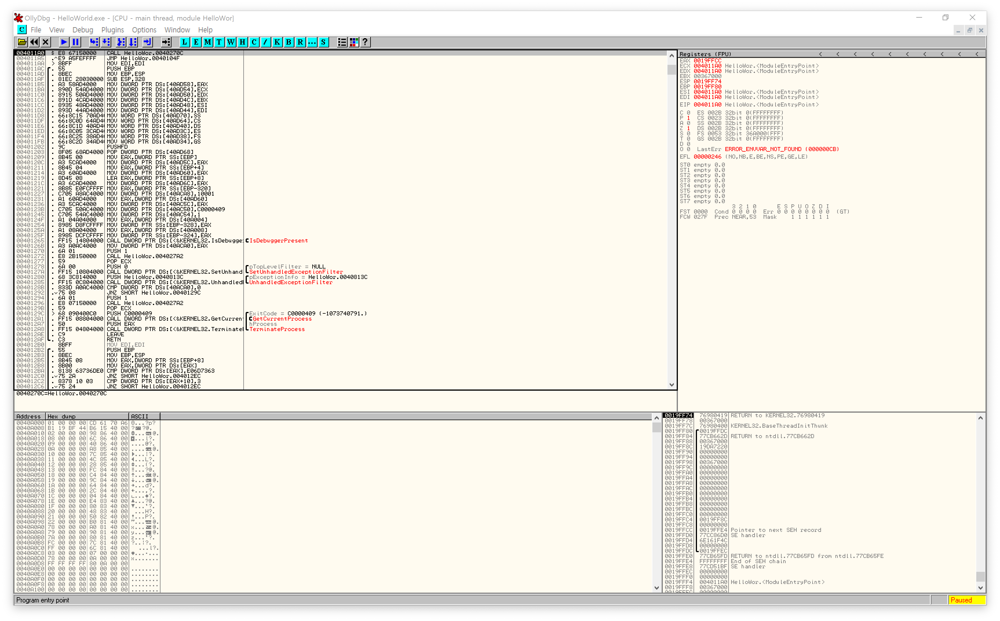

Yesterday, I installed the debugger which is called the ollydbg.  
After you launch it and open the examples from the book, "리버싱핵심원리", you'll see a window like this.

The up-left side one is a code window and the up-right side one is a register window.
The below one at the left side is the dump window and the right side one is the stack window.

Code window has the disassembled code with some comments, label and the positions of jump and loop which changes where the code is executing.  
Register window displays the state of registers such as EAX, ECX, EDX, EBX, ESP, EBP, ESI, and EDI. Some registers are modifiable if you want.  
Dump window displays the current memory's state. You can see wherever in the memory you want in HEX, ASCII or Unicode.  
Stack window shows the current state of the stack which ESP register points as the name.

Where debugger waiting is the EP(Entry Point), which is the beginning address of the program that I'm currently debugging.  
This is all for today.  

I think to translate all the contents in the book is inefficient.  
Therefore since tomorrow, I'll just write a simple report about what  I learned.
